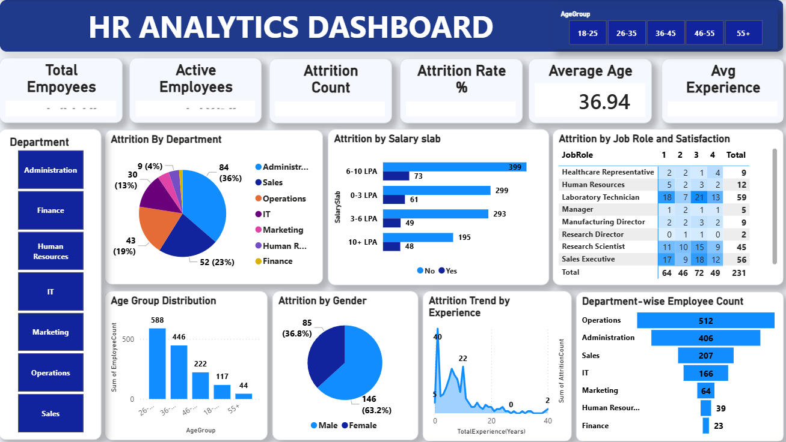

# 📊 HR Analytics Dashboard (Power BI)

## Overview

This project presents an interactive HR Analytics Dashboard built using Microsoft Power BI to analyze employee attrition, workforce demographics, and departmental trends. The dashboard enables HR professionals and business leaders to monitor workforce health, identify attrition patterns, and support data-driven HR decisions.

---

## Dashboard Preview

> Replace the image below with your dashboard screenshot.

---

## Business Problem

Employee attrition can significantly impact productivity, recruitment costs, and organizational performance. This dashboard helps answer important HR questions such as:

- What is the overall attrition rate?
- Which departments experience the highest attrition?
- Which salary groups have higher employee turnover?
- How does employee satisfaction relate to attrition?
- Which age groups are most represented?
- How does employee experience affect attrition?

---

## Dashboard Features

### KPI Cards

- Total Employees
- Active Employees
- Attrition Count
- Attrition Rate
- Average Employee Age
- Average Years of Experience

### Interactive Filters

- Age Group
- Department

### Visualizations

- Attrition by Department
- Attrition by Salary Slab
- Attrition by Job Role and Satisfaction Level
- Age Group Distribution
- Attrition by Gender
- Attrition Trend by Experience
- Department-wise Employee Count

---

## Key Insights

- Overall employee attrition can be monitored through KPI cards.
- Certain departments contribute more to employee turnover.
- Employees within specific salary slabs experience higher attrition.
- Job satisfaction has a noticeable relationship with employee attrition.
- Most employees belong to the younger and mid-career age groups.
- Attrition tends to decrease as employee experience increases.

---

## Tools & Technologies

- Microsoft Power BI
- Power Query
- DAX
- Data Modeling
- Interactive Dashboard Design
